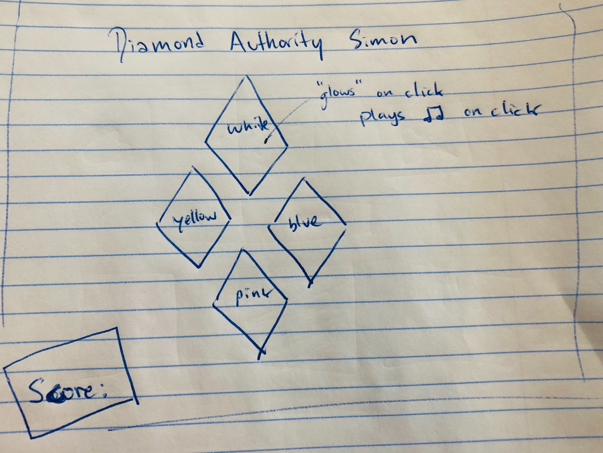

# diamond-authority-simon
# **Diamond Authority Simon**
The classic Simon memory game, with a Steven-Universe twist

### ___Background Info___
I have a real soft-spot for animated stuff, and Steven Universe (a gorgeously-animated show on Cartoon Network which follows the adventures of a young boy and his friends in space) is one of my favorites. A major story arc of the show is Steven and his friends attempting to save Earth from a dictortatorship of a technologically-advanced race of aliens, collectively referred to as "The Diamonds."

In this game, you are a doomed rebel, desperately trying to divert the Diamond Authority's attention from your cause. You can't win, but that doesn't mean you can't try :)

### ___Technologies Used___
Javascript, HTML, and CSS.

### ___Getting Started___
Play my game here: https://dagnyjay.github.io/diamond-authority-simon/

### ___Next Steps___

